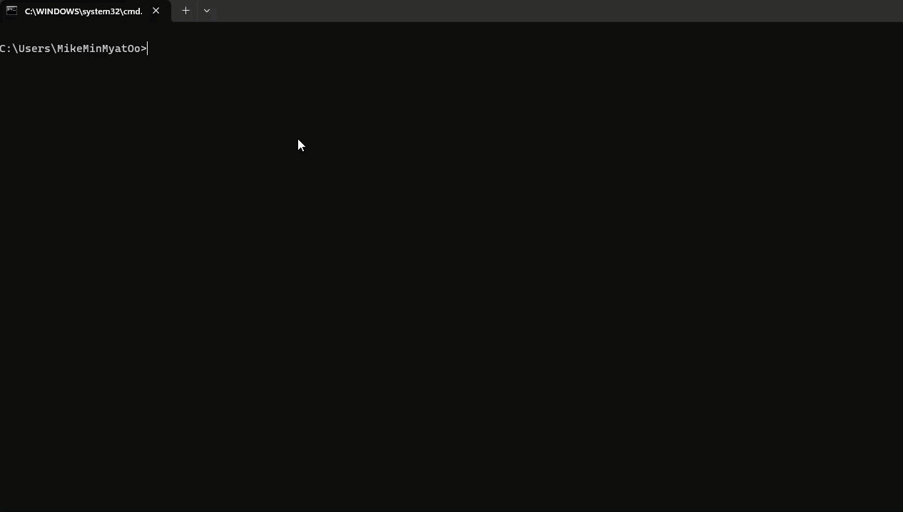

# ProjectCodeAudit



ProjectCodeAudit is a tool for running Code Climate analysis on your codebase using Docker. This repository contains a helpful batch script and all the necessary components to simplify the process of running Code Climate analysis on your projects.

## Prerequisites

- Docker installed on your machine
- Git installed on your machine

## Getting Started

1. Clone this repository:

```sh
git clone https://github.com/minmyatoo/project-code-audit.git
```

2. Navigate to the cloned repository:

```sh
cd ProjectCodeAudit
```

3. Run the batch script `codeclimate.cmd`:

```sh
codeclimate
```
